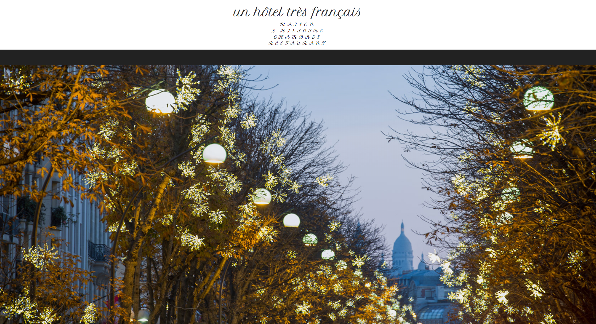
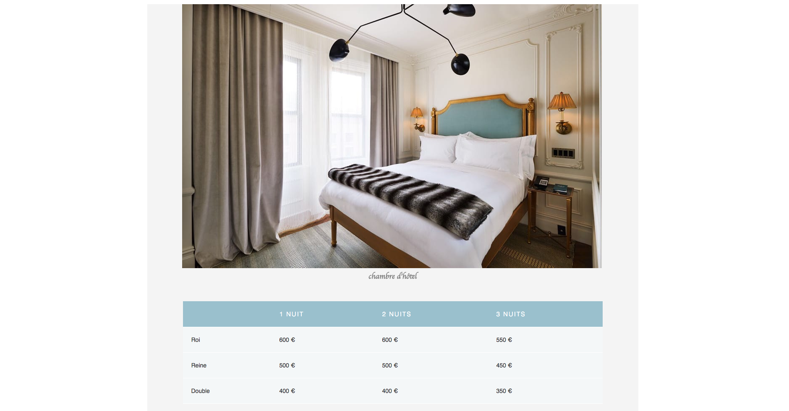

# Un Hotel

Full MEAN stack application hotel proof of concept:
Users have the ability to reserve a hotel room

## Technologies Used

* JavaScript
* AngularJS
* AngularJS
* MongoDB
* Express.js
* Node.js
* HTML5
* CSS
* Bootstrap

## Why I created this application
To practice the MEAN stack while enhancing my HTML and CSS skills

### Rooms View

